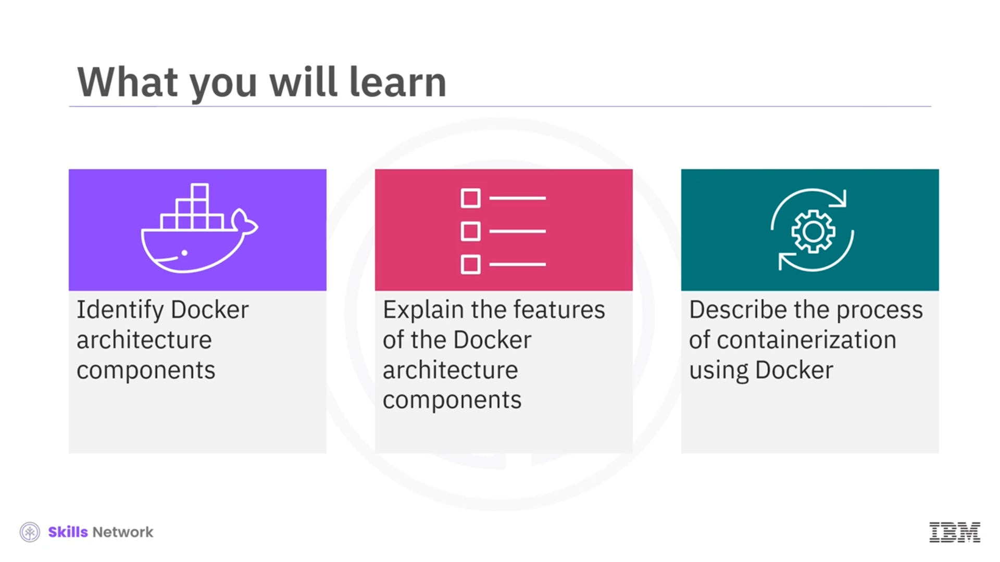
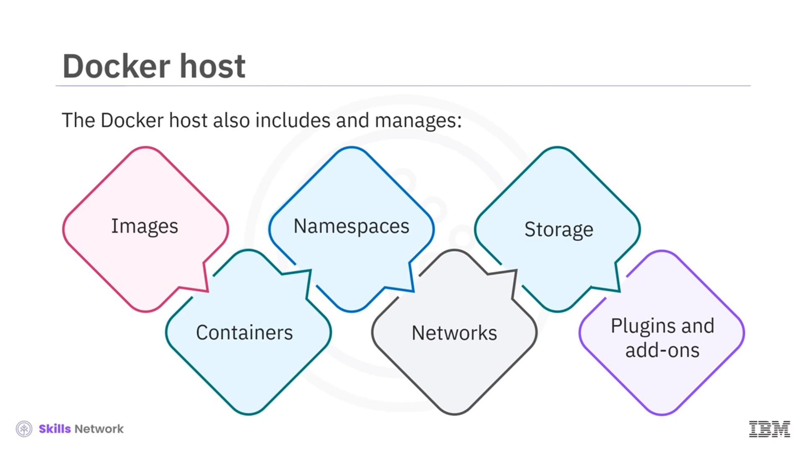
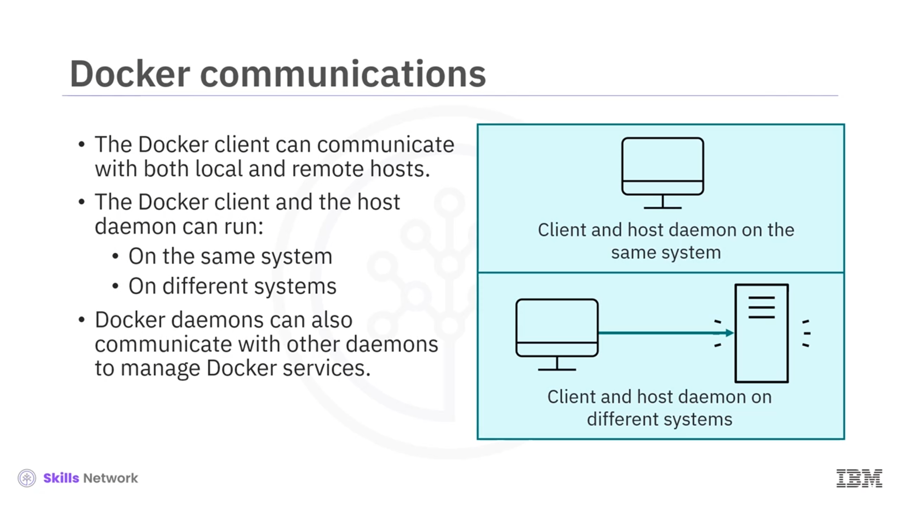
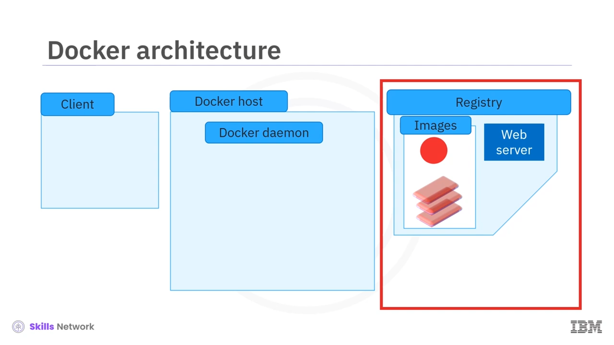

# 🐳 Docker Mimarisi

## 🎯 Dersin Amaçları ve Docker Mimarisine Giriş

Merhaba ve **Docker mimarisine** hoş geldiniz. Bu videoyu izledikten sonra **Docker mimarisinin bileşenlerini** tanımlayabilecek, bu bileşenlerin özelliklerini açıklayabilecek ve **Docker** kullanarak **konteynerleştirme sürecini** anlatabileceksiniz.

 **Docker istemci–sunucu mimarisi** , eksiksiz bir uygulama çalışma ortamı sağlar. Temel **Docker bileşenleri** şunlardır:  **istemci (client)** , **Docker ana bilgisayarı (host)** ve  **kayıt defteri (registry)** .

Docker’ın nasıl çalıştığına üst düzey bir bakış yapalım: Genellikle **Docker ana bilgisayarı** olarak adlandırılan sunucuya talimat göndermek için **Docker komut satırı arayüzünü (CLI)** veya **Docker istemcisi** aracılığıyla  **REST API** ’lerini kullanırsınız.

## 🧱 Docker Ana Bilgisayarı ve Arka Plan Programı (Daemon)

 **Docker ana bilgisayarı** , genellikle **dockerd** olarak bilinen **arka plan programını (daemon)** içerir. Arka planda çalışan bu program, **Docker API** isteklerini veya `docker run` gibi komutları dinler ve bu komutları işler.

 **Daemon** , Docker kapsayıcılarını oluşturmak, çalıştırmak ve dağıtmak için ağır işleri yapan bileşendir. Ayrıca Docker kapsayıcı **görüntülerini (images)** bir **kayıt defterinde (registry)** saklar.

Docker ana bilgisayarı;  **görüntüleri** ,  **kapsayıcıları** ,  **ad alanlarını (namespaces)** ,  **ağları** , **depolamayı** ve **eklentileri (plugins)** içerir ve yönetir. Yerel ve uzak Docker ana bilgisayarlarıyla iletişim kurmak için **Docker istemcisini** kullanabilirsiniz.

Docker istemcisini ve arka plan programını aynı sistemde çalıştırabilir veya Docker istemcinizi uzak bir Docker daemon’ına bağlayabilirsiniz. Farklı **Docker daemon** örnekleri, **Docker servislerini** yönetmek için birbirleriyle de iletişim kurabilir.

## 📦 Kayıt Defteri (Registry) ve Docker Görüntülerinin Saklanması

 **Docker görüntüleri** , bir **kayıt defterinde (registry)** depolanır ve buradan dağıtılır. Bu kayıt defteri:

* Herkesin erişebildiği **Docker Hub** gibi **herkese açık (public)** olabilir.
* Sadece kurum içi erişime açık **özel (private)** bir kayıt defteri olabilir.

İşletmeler, güvenlik ve uyumluluk sebepleriyle genellikle özel bir kayıt defteri kullanmayı tercih eder.

Kayıt defteri konumları:

* **IBM Cloud Container Registry** gibi üçüncü taraf bir sağlayıcıda barındırılabilir,
* Ya da özel veri merkezlerinde veya bulut ortamında  **kendi kendine barındırılabilir (self-hosted)** .

Görüntülerin kayıt defterine nasıl taşındığını inceleyelim: Önce geliştiriciler, otomasyon süreçleri veya bir **CI/CD derleme hattı** kullanarak görüntüleri oluşturur ve  **Docker’ın bu görüntüleri depoladığı kayıt defterine gönderir (push)** . Ardından  **yerel makineler** , **bulut sistemleri** ve **şirket içi sistemler** bu görüntüleri kayıt defterinden  **çekebilir (pull)** .

## 🛠️ Konteyner Görüntüsü Oluşturma Adımları

Süreci daha ayrıntılı olarak inceleyelim. Elimizde,  **istemciyi** , **Docker daemon’ını içeren Docker ana bilgisayarını** ve **kayıt defterinde depolanan mevcut görüntüleri** gösteren Docker mimarisinin görsel bir temsili olduğunu düşünün.

**Konteynerleştirme sürecini** adım adım kontrol edelim. Bir **kapsayıcı görüntüsü (container image)** oluşturmak için Docker’ı şu şekilde kullanırsınız:

1. Önce mevcut bir **temel görüntü (base image)** veya bir **Dockerfile** kullanın.
2. Daha sonra, bir ad (tag) içeren bir kapsayıcı görüntüsü oluşturan `docker build` komutunu verin.
3. Son olarak, bu görüntüyü kayıt defterine saklamak için `docker push` komutunu kullanın.

## ▶️ Görüntüden Çalışan Konteyner Oluşturma

Bir görüntüden **çalışan bir konteyner** oluşturma süreci şöyle işler:

Ana bilgisayar, önce istenen görüntünün zaten yerel olarak mevcut olup olmadığını kontrol eder. Eğer görüntü yerelde varsa, **konteyneri oluşturmak** için görüntü adıyla `docker run` komutu çalıştırılır.

Görüntü ana bilgisayarda yoksa, **Docker istemcisi** kayıt defterine bağlanır ve gerekli görüntüyü ana bilgisayara  **çeker (pull)** . Ardından **arka plan programı (daemon)** bu görüntüyü kullanarak **çalışan bir kapsayıcı (running container)** oluşturur.

## 🧩 Docker Mimarisi Özeti ve Konteynerleştirme Süreci

Bu videoda, **Docker mimarisinin** üç ana bileşenden oluştuğunu gördünüz: bir  **Docker istemcisi** , bir **Docker ana bilgisayarı** ve bir  **kayıt defteri** .

 **İstemci** , komutları ve  **REST API** ’lerini kullanarak ana bilgisayar ile etkileşime girer.  **Docker ana bilgisayarı** , genellikle **dockerd** adı verilen arka plan programını içerir. Bu ana bilgisayar;  **görüntüleri** ,  **kapsayıcıları** ,  **ad alanlarını** ,  **ağları** , **depolamayı** ve **eklentileri** yönetir.

**Konteynerleştirme (containerization)** ise bir uygulamayı çalıştırmak için gerekli her şeyi içeren bir **görüntü (image)** oluşturmak, bu görüntüyü bir kayıt defterine **iletmek (push)** ve sonrasında bu görüntüden **çalışan bir konteyner** olarak **çalıştırmak (run)** için kullanılan süreçtir.

Çalışan bir konteyner oluşturmak için bu adımlar sırasıyla uygulanır.

