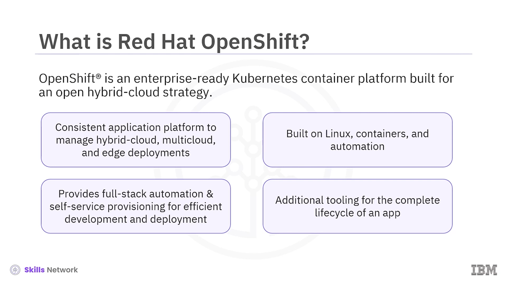
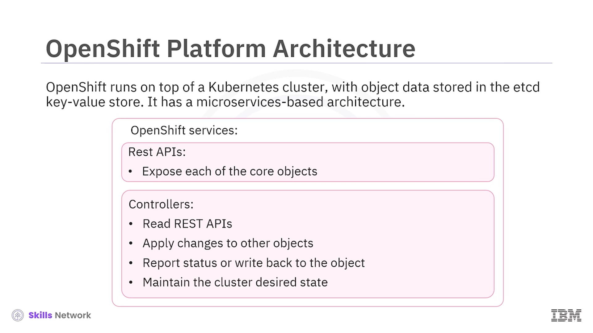

# 🚀 Red Hat OpenShift’e Giriş

## 🎯 Öğrenme Hedefleri

Red Hat OpenShift’e girişe hoş geldiniz.

Bu videoyu izledikten sonra:

* OpenShift’in ne olduğunu açıklayabilecek ve özelliklerini sıralayabileceksiniz.
* OpenShift CLI’yi, mimarisini ve bileşenlerini tanımlayabileceksiniz.
* OpenShift’i Kubernetes ile karşılaştırabileceksiniz.

---

## ☁️ OpenShift Nedir?

Red Hat tarafından geliştirilen ve desteklenen OpenShift, hibrit bulut stratejisi için geliştirilmiş, kurumsal kullanıma hazır bir Kubernetes konteyner platformudur.

Hibrit, çoklu bulut ve *edge* dağıtımlarını yönetmek için tutarlı bir uygulama platformu sağlar.

Linux, konteynerler ve otomasyonun teknolojik temeli üzerine inşa edilmiştir.

Geliştiricilerin fikirleri geliştirmeden üretime verimli bir şekilde taşıyabilmesi için uçtan uca otomatikleştirilmiş işletim ve self-servis sağlama yetenekleri sunar.

Konteyner orkestrasyonuna ek olarak, uygulamaların tüm yaşam döngüsü etrafında ek araçlar sağlar.

Derlemeden ( *build* ), CI/CD’ye, izlemeye ( *monitoring* ) ve loglara kadar tüm aşamaları kapsar.

---

## 🤝 OpenShift ve Kubernetes İlişkisi

Hem Kubernetes hem de OpenShift, konteyner orkestrasyon platformlarıdır.

Kubernetes, OpenShift’in kritik bir bileşenidir.

OpenShift, konteynerleştirilmiş uygulamalar için daha sağlam ve kapsamlı bir platform sağlamak üzere Kubernetes’in bir uzantısı olarak kullanılır.

---

## 🌟 OpenShift’in Başlıca Özellikleri

OpenShift’in özelliklerini gözden geçirelim.

Uygulamalar, birkaç saniye içinde yüzlerce node üzerinde binlerce instance’a kadar ölçeklenebilir.

Esnek hibrit altyapı seçenekleri, dağıtım ve yönetimi basitleştirir.

Açık kaynak standartları, Kubernetes ve *Open Container Initiative (OCI)* konteynerlerini kullanır; bu da geliştirmenin tanıdık olduğu ve konteynerlerin birden çok ortam arasında taşınabilir olduğu anlamına gelir.

Kapsamlı bir geliştirici araç seti, çoklu dil desteği, komut satırı, IDE entegrasyonları ve daha fazlasını içerir.

*Over-the-air* platform güncellemelerini destekler ve *operator hub* üzerinden sunulan servisler, tek tıklamayla yapılandırılıp dağıtılabilir ve güncellenebilir.

Konteyner ve uygulama derlemeleri, dağıtımları, ölçeklendirme ve sağlık yönetimi sadeleştirilmiş ve otomatikleştirilmiştir.

OpenShift ayrıca, *edge* senaryolarında daha iyi eşleme, bağlantı ve kullanılabilirlik için daha küçük ayak izine sahip topolojilerin desteklenmesini geliştirir.

Birden fazla cluster’ı ölçekli şekilde yönetmeyi ve politikaları zorunlu kılmayı kolaylaştırır.

Erişim kontrolleri, ağ ve kurumsal registry, yerleşik tarayıcı, gelişmiş tehdit tespiti, yaşam döngüsü zafiyet yönetimi ve risk profilleme sunar.

OpenShift, durumsal ( *stateful* ) ve durumsuz ( *stateless* ) uygulamaları çalıştırmak için kurumsal kalıcı depolama çözümlerini destekler.

OpenShift iş ortağı ekosistemi; ek depolama ve ağ servislerinin yanı sıra IDE, CI entegrasyonları ve daha fazlasını sağlar.

---

## 🔍 OpenShift ve Kubernetes Karşılaştırması

Ana yönler açısından OpenShift ve Kubernetes’i karşılaştıralım.

* OpenShift bir üründür, Kubernetes ise açık kaynaklı bir projedir.
* OpenShift’te kurulum başladıktan sonra kurulumla ilgili seçenekler sınırlıdır; Kubernetes ise her Linux ortamına kurulabilir.
* OpenShift daha az esnektir, Kubernetes ise daha esnektir.
* OpenShift, çevrimiçi olarak Azure ve *dedicated* seçenekleriyle sunulurken; Kubernetes, AWS üzerinde EKS, GCP üzerinde GKE ve Azure üzerinde AKS ile kullanılabilir.
* OpenShift  *image stream* ’leri daha iyi yönetim sağlar, Kubernetes’te konteyner imaj yönetimi ise o kadar kolay değildir.
* OpenShift’in çok katı bir güvenlik politikası vardır, Kubernetes’te güvenlik bakımı ise daha kolaydır.
* OpenShift *router* nesneleri harici erişime izin verirken, Kubernetes *ingress* nesneleri Kubernetes cluster’larına harici erişime izin verir.

* OpenShift, daha az esnek olan *deployment config* komutunu kullanırken, Kubernetes daha esnek *deployment* nesnelerini kullanır.
* OpenShift iyi bir kullanıcı deneyimi sağlar, Kubernetes ise daha iyi bir kullanıcı deneyimi için ek araçlar gerektirir.
* OpenShift, kullanıma hazır iyi ağ çözümleri sunar, Kubernetes ise ağ çözümleri mevcut olmadığında üçüncü parti eklentiler sağlar.
* OpenShift iyi bir servis kataloğu sağlar, Kubernetes ise cluster’larda daha iyi servisler için daha az olanak sunar.
* OpenShift, başlangıç seviyesindekiler için öğrenmesi kolay, kullanıcı dostu bir web konsolu düzenine sahiptir; Kubernetes konsol düzeni ise yeni başlayanlar için öğrenmesi zordur.
* OpenShift CI ve CD, Jenkins ile entegre olurken; Kubernetes CI ve CD entegre edilebilir, ancak Jenkins ile değil.

---

## 🏗️ OpenShift Mimarisi ve Temel Bileşenler

OpenShift, Kubernetes cluster’ının üzerinde çalışır ve nesne verileri `etcd` anahtar-değer deposunda saklanır.

Mikroservis tabanlı bir mimariye sahiptir.

Servisleri; çekirdek nesneleri ortaya çıkaran REST API’ler ve REST API’leri okuyan, diğer nesnelere değişiklikleri uygulayan, durumu raporlayan veya nesneye geri yazan  *controller* ’lardan oluşur.

Bu controller’lar ayrıca cluster’ın istenen durumunu korur.

Docker, Linux tabanlı hafif konteyner imajlarını paketlemek ve oluşturmak için bir soyutlama sağlar.

Kubernetes, cluster yönetimi sağlar ve konteynerleri birden fazla host üzerinde orkestre eder.

OpenShift özellikleri; geliştiriciler için kaynak kodunun, derlemelerin ve dağıtımların yönetimini ekler, imajlar sisteminiz boyunca akarken bunların ölçekli şekilde yönetilmesi ve terfi ettirilmesini sağlar, uygulama yönetimini ölçekli hâle getirir, büyük geliştirici organizasyonları için ekip ve kullanıcı takibi yönetimini sağlar ve cluster’ı destekleyen bir ağ altyapısı sunar.

OpenShift ortamında, Kubernetes master bileşenleri Red Hat Enterprise Linux CoreOS üzerinde çalışırken, worker node’lar Red Hat Enterprise Linux’u destekler. Bu, Red Hat taban katmanıdır.

Sonraki katmanda, Kubernetes mimarisi ve bir dizi servis vardır.

Cluster servisleri; tümleşik izleme, cluster içinde özel bir registry, ağ çözümleri ve daha birçok bileşeni içerir.

Platform servisleri, kullanıcıların iş yüklerini yönetmesine yardımcı olur.

Uygulama servisleri, kullanıcıların bulut yerel ( *cloud native* ) uygulamalar geliştirmesine yardımcı olur.

Geliştirici servisleri, geliştirici üretkenliğini artırır.

---

## 🧰 Komut Satırı Araçları: `oc` ve `kubectl`

OpenShift, kullanıcıların terminalden çeşitli yönetim ve geliştirme işlemlerini gerçekleştirmesini sağlayan bir dizi komut satırı aracı (CLI) sunar.

OpenShift CLI veya `oc`, uçtan uca işlemleri gerçekleştirmek için en yaygın kullanılan CLI aracıdır.

Windows, Linux veya Mac üzerinde çalışır.

`oc`, komut betikleri kullanarak proje kaynak kodu ile doğrudan çalışmanıza, OpenShift işlemlerini betik hâline getirmenize ve web konsoluna erişimin sınırlı olduğu veya bant genişliğinin kısıtlı olduğu durumlarda projeleri yönetmenize imkân tanır.

OpenShift, bir Kubernetes cluster’ının üzerinde çalıştığı için `kubectl`’in bir kopyası da `oc` ile birlikte gelir.

`oc` ve `kubectl` ikilileri aynı yetenekleri sunar, ancak `oc`, OpenShift’e özgü özellikleri doğal olarak destekleyecek şekilde daha da genişletilmiştir; örneğin  *deployment config* ,  *build config* ,  *route* , *image stream* ve  *image stream tag* ’ler.

Bunlar standart Kubernetes’te mevcut değildir.

`oc` ayrıca kimlik doğrulama için yerleşik bir *login* komutu sunar.

`new app` gibi ek komutlar da `oc` tarafından desteklenir; bu komutlar mevcut kaynak kodu veya önceden oluşturulmuş imajları kullanarak yeni uygulamaların başlatılmasını kolaylaştırır.

---

## 📚 Bu Videodan Öğrendikleriniz

Bu videoda şunları öğrendiniz:

* Kubernetes ve OpenShift, konteyner orkestrasyon platformlarıdır.
* OpenShift, açık hibrit bulut için geliştirilmiş, kurumsal kullanıma hazır bir Kubernetes konteyner platformudur.
* OpenShift, nesne verilerinin `etcd` anahtar-değer deposunda saklandığı bir Kubernetes cluster’ının üzerinde çalışır.
* OpenShift kullanımı daha kolaydır, Jenkins ile entegre olur ve daha fazla servis ve özelliğe sahiptir.
