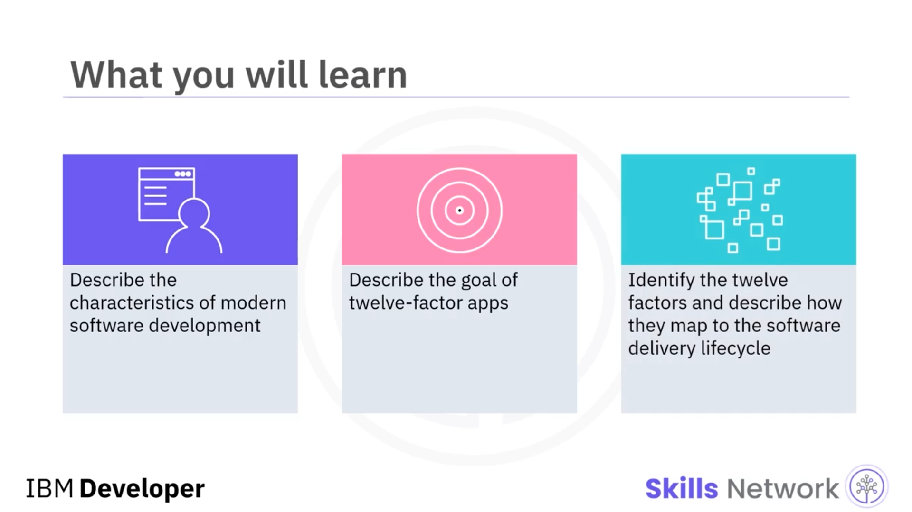
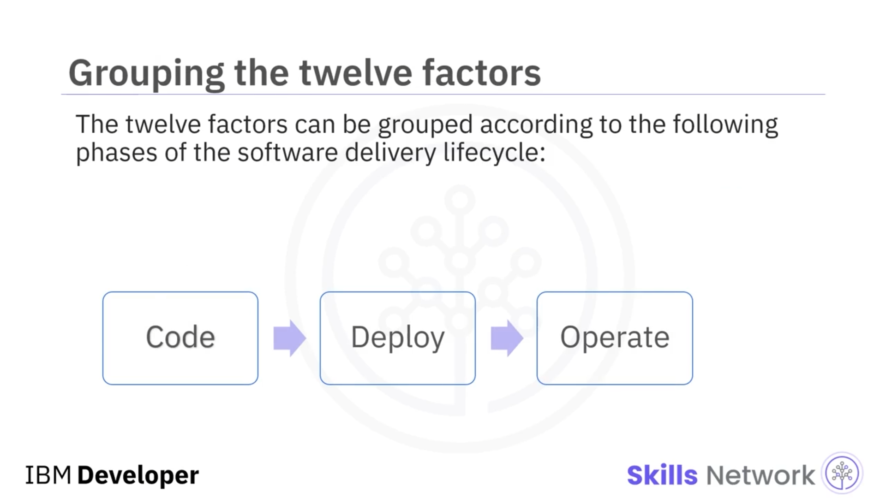
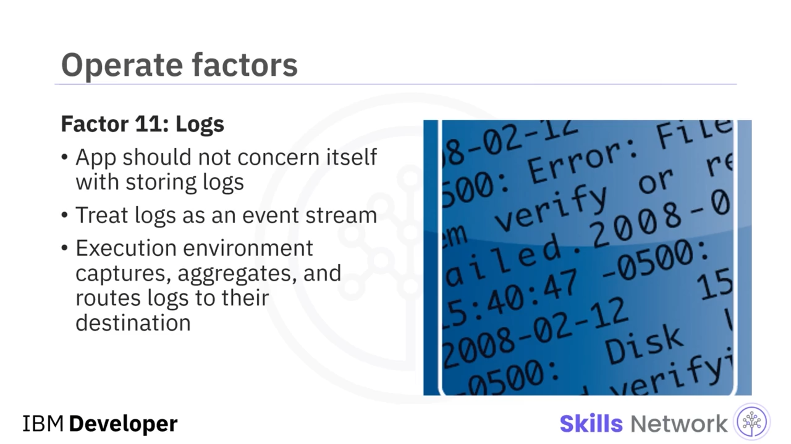

# 🎛️ Twelve-Factor App Methodology

## 🎓 Öğrenme Hedefleri

‘Twelve-Factor App Methodology’ye hoş geldiniz.

Bu videoyu izledikten sonra şunları yapabileceksiniz: modern yazılım geliştirmenin özelliklerini açıklamak,  *twelve-factor app* ’lerin amacını tanımlamak ve on iki faktörü belirleyerek bu faktörlerin yazılım teslim yaşam döngüsünün üç aşamasına nasıl karşılık geldiğini açıklamak.

---

## 🌐 Modern Yazılım Geliştirme ve SaaS

Modern yazılım geliştirmede yazılım genellikle bir hizmet olarak sunulur.

Yazılım merkezi olarak barındırılır ve internet üzerinden erişilir. Bu tür yazılıma çoğunlukla bir *web app* veya *software-as-a-service* (kısaca  *SaaS* ) denir.

Muhtemelen son bir gün içinde çeşitli  *web app* ’ler kullanmışsınızdır.

İnterneti kullanarak rezervasyon yaptığınızda veya vergi beyanında bulunduğunuzda bir *web app* ile etkileşime girmiş olursunuz.

---

## 🧱 Twelve-Factor App Metodolojisinin Kapsamı

*Twelve-factor app* metodolojisi bu tür uygulamalar için uygundur.

 *Mikroservisler* ,  *twelve-factor app* ’ler için bir gereklilik değildir. Ancak mikroservisler çoğu zaman *twelve-factor application methodology* ile birlikte kullanılır.

On iki faktör, yazılım teslim yaşam döngüsünün *code* (kod), *deploy* (dağıtım) ve *operate* (işletme) aşamalarına gruplandırılabilir.

Yazılım teslim yaşam döngüsünün *code* aşamasına karşılık gelen üç faktörle başlayacağız.

---

## 🧾 Faktör 1 – Codebase

İlk faktör, Faktör 1:  *Codebase* ’dir.

Bir uygulamanın  *codebase* ’i her zaman Git gibi bir sürüm kontrol sistemi içinde takip edilmelidir.

Bir *codebase* ile bir uygulama arasında bire bir ilişki vardır.

Bir uygulama, **tek** bir *codebase* içinde bulunmalıdır. Ancak uygulamanın birden çok  *deploy* ’u (yayını/örneği) olacaktır.

Bu  *deploy* ’larda *codebase* aynı olsa da, her bir  *deployment* ’ta farklı uygulama sürümleri bulunabilir.

Örneğin geliştirme ( *dev* ) veya test ortamlarında, henüz üretime ( *production* ) ulaşmamış değişiklikler olabilir.

---

## 🛠️ Faktör 5 – Build, Release ve Run

Sonraki faktör, Faktör 5:  *Build, release, and run* ’dır.

Bu aşama, bir  *codebase* ’in üretim  *deployment* ’ına nasıl dönüştüğünü gösterir.

*Build* aşaması, kodu derler, bağımlılıkları toplar ve ardından  *codebase* ’i bir çalıştırılabilir birim olan  *build* ’e dönüştürür.

*Release* aşaması,  *build* ’i,  *deployment* ’ın mevcut konfigürasyonu ile birleştirerek kodu çalışmaya hazır hale getirir.

Ardından *run* aşaması, uygulamayı uygular (çalıştırır).

Bu üç aşamayı kesin bir şekilde birbirinden ayırmalısınız.

Örneğin, kod çalışma zamanında değiştirilebilir olmamalıdır; çünkü bu, söz konusu değişikliklerin *build* aşamasına dahil edilmesini engeller.

---

## ⚖️ Faktör 10 – Dev/Prod Parity

Faktör 10,  *dev/prod parity* ’dir.

Bu faktör, geliştirme ( *development* ) ve üretim ( *production* ) ortamları arasındaki farklılıkları en aza indirir. Bu da değişikliklerin üretime hızlı bir şekilde taşınmasını sağlayan sürekli teslimi ( *continuous delivery* ) etkinleştirmek için gereklidir.

Bu eylem, kodun bir ortamda düzgün çalışıp başka bir ortamda çalışmama ihtimalini azaltır.

Parity özellikle arka uç ( *backend* ) servisleri için kritik öneme sahiptir.

Eğer üretimde MySQL veritabanı kullanıyorsanız, geliştirme ortamlarınızda da aynı MySQL veritabanı sürümünü kullanmalısınız.

Parity, hataların geliştirme sürecinin daha erken aşamalarında yakalanmasına yardımcı olur.

---

## 📦 Faktör 2 – Dependencies

Bahsedeceğimiz son *code* faktörü Faktör 2:  *Dependencies* ’tir.

Bir uygulama, en az güvenilir bağımlılığı kadar güvenilirdir.

Bu nedenle  *twelve-factor app* ’ler, herhangi bir paket, bağımlılık veya aracın zımnen var olduğuna güvenmez.

Tüm bağımlılıkları açıkça belirtmek zorundasınız.

Bu sayede yeni bir geliştirici  *codebase* ’i aldığında, makinesinde herhangi bir bağımlılığın zaten yüklü olduğu varsayımı yapılmamış olur.

---

## ⚙️ Faktör 3 – Config

İlk *deploy* faktörü, Faktör 3:  *Config* ’tir.

Konfigürasyon,  *deployment* ’lar arasında farklı olabilen her şeydir.

Örneğin, aşama ( *staging* ) ve üretim ( *production* ) ortamlarında büyük olasılıkla farklı veritabanları kullanılır; bu nedenle bir geliştirici, her bir *deployment* için veritabanının kimlik bilgilerini ve konumunu yapılandırmalıdır.

Konfigürasyonlar ortamlar arasında farklı olabileceği için, konfigürasyonları sabitler ( *constants* ) olarak depolamaktan kaçınmalısınız.

Konfigürasyonu, *environment variables* içinde saklayın; çünkü bunlar  *code* ’u değiştirmeden  *deployment* ’lar arasında kolayca değiştirilebilir.

---

## 🔌 Faktör 4 – Backend Services

Faktör 4,  *Backend services* ’tir.

Bir  *twelve-factor app* , yerel ve üçüncü taraf servisler arasında ayrım yapmamalıdır.

Her ikisi de, URL veya diğer konum bilgileri ve gerekli kimlik bilgileri ile erişilebilir olmalıdır; böylece bir geliştirici,  *backend service* ’i kodu değiştirmeden kolayca değiştirebilir.

Örneğin bir veritabanı sorun yaşarsa, yeni bir veritabanı oluşturulup devreye alınabilir ve kodu değiştirmek zorunda kalmadan mevcut veritabanının yerine kullanılabilir.

---

## 🧮 Faktör 6 – Processes

Faktör 6,  *Processes* ’tir.

Bir uygulama, bir ortam içinde bir veya daha fazla *process* olarak çalışır.

 *Process* ’ler durum tutmamalı ( *stateless* ) ve hiçbir şeyi paylaşmamalıdır ( *share nothing* ).

Kalıcı veriyi, veritabanı gibi bir *backend service* içinde depolamalısınız; çünkü bellek ve dosya sistemleri  *process* ’ler arasında paylaşılmaz.

Başka bir  *process* , sonraki bir işlemi ( *transaction* ) ele alırsa, bu sonraki işlem, önceki *process* içindeki veriye erişemez.

Bu nedenle verilerin merkezi bir yerde saklanması gerekir.

---

## 🔉 Faktör 7 – Port Binding

Port bağlama, Faktör 7’dir.

Web’e açık bir servis oluşturduğunuzda, bir web sunucusu çalışma zamanında uygulamanın içine enjekte edilmemelidir.

Bunun yerine, *web app* HTTP’yi bir porta bağlanarak ( *bind* ) ve bu port üzerinden gelen istekleri dinleyerek dışa aktarmalıdır.

Port binding, HTTP ve diğer servisler için kullanılabilir.

Bir portu bağlama işlemi genellikle kod içinde, bir web sunucu kütüphanesini bağımlılık olarak tanımlayarak yapılır.

Bunun sonucunda, bu uygulamalara bir URL üzerinden erişilebildiği için, başka uygulamalar için *backend service* haline gelebilirler.

---

## 🚀 Operate Faktörlerine Giriş

Şimdi *operate* faktörlerine geçiyoruz.

Faktör 8 ile başlayalım:  *Concurrency* .

---

## 📈 Faktör 8 – Concurrency

Bir uygulama, artan yükü yönetmek için eşzamanlı ( *concurrent* )  *process* ’ler çalıştırır.

 *Process* ’ler durum tutmadığı ve hiçbir şeyi paylaşmadığı için, bir uygulama daha fazla *process* başlatarak yatayda ölçeklenebilir ve gelen ek istekleri,  *process* ’ler arasında bağımlılıklar oluşturmadan karşılayabilir.

---

## ♻️ Faktör 9 – Disposability

Faktör 9,  *Disposability* ’dir ve uygulama  *process* ’lerinin en az başlangıç süresine ihtiyaç duymasını ve sonlandırıldıklarında düzgün bir şekilde kapanmalarını ( *graceful shutdown* ) belirtir.

Hızlı başlangıç, kod veya konfigürasyondaki değişiklikleri hızlıca *deploy* etmenizi sağlar.

Ayrıca, yeni  *deploy* ’lar hızlı başladığı için uygulamaları kolayca ölçekleyebilirsiniz.

---

## 📋 Faktör 11 – Logs

Faktör 11, logların nasıl ele alınacağını belirler.

Loglar, uygulama performansına yönelik görünürlük sağlar; bu nedenle bir uygulama, logların saklanmasıyla ilgilenmemelidir.

Bunun yerine, uygulama ortamı logları, standart çıktıya ( *standard output* ) yazılan bir olay akışı ( *stream of events* ) olarak ele almalıdır.

Çalışma zamanı ortamı, çalışan tüm uygulamaların log akışlarını yakalayabilir, toplayabilir ve bunları hedeflerine yönlendirebilir.

Bu, özellikle hedefin bir log analiz aracı olduğu durumlarda oldukça faydalıdır.

---

## 🧮 Faktör 12 – Admin Processes

Son olarak, Faktör 12:  *Admin processes* ’tir.

 *Admin processes* , veritabanı migrasyonu gibi bir uygulamayı yönetmek için kullanılan tek seferlik  *process* ’lerdir.

 *Admin processes* , aynı *codebase* ve  *config* ’i kullanarak bir *release* üzerinde çalışır.

Ek olarak, uygulama kodu,  *admin processes* ’i de içermelidir; böylece bu  *process* ’ler uygulama ile senkronize halde kalır.

---

## 📚 Özet – Bu Videoda Öğrendikleriniz

Bu videoda şunları öğrendiniz:

* Modern yazılım geliştirme, çoğu zaman merkezi olarak barındırılan, web tabanlı, *software-as-a-service* uygulamaları sunar.
* *Twelve-factor app methodology* , geliştiricilerin daha verimli *SaaS* uygulamaları oluşturmasını sağlar.
* On iki faktör, yazılım teslim yaşam döngüsünün  *code* , *deploy* ve *operate* aşamalarıyla eşleştirilir.

