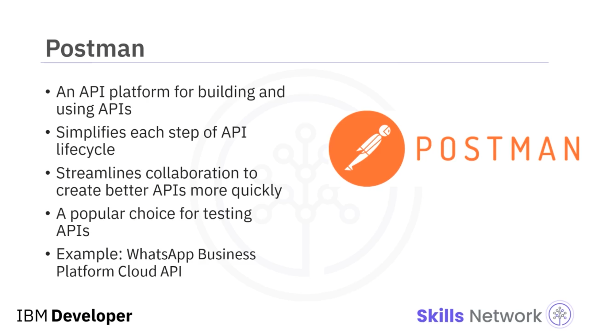

# 📡 cURL ve Postman Kullanarak API İstekleri Yapma

## 🎯 Video Hedefleri

‘cURL ve Postman kullanarak API istekleri yapma’ya hoş geldiniz.

Bu videoyu izledikten sonra, HTTP istekleri yapmak için `cURL`'ü nasıl kullanacağınızı ve HTTP istekleri yapmak için  *Postman* 'i nasıl kullanacağınızı açıklayabilecek duruma geleceksiniz.

## 🌐 Sunucuya Veri Aktarımı ve Linux Araçları

Bir sunucuya veri göndermek ve bir sunucudan veri almak, gerekli ağ protokollerini destekleyen araçlar gerektirir.

Linux, bu amaç için oluşturulmuş birden fazla araca sahiptir; bunların en popüleri `curl`dür.

`curl`, “Client URL”nin kısaltmasıdır ve çeşitli ağ protokolleri üzerinden veri aktarımını sağlayan bir komut satırı aracıdır.

1998'de geliştirilmiştir ve o zamandan beri, ilgili bir URL ve gönderilmesi veya alınması gereken veriler belirtilerek web veya uygulama sunucuları ile iletişim kurmak için kullanılmaktadır.

`curl`, verileri aktarmak için komut satırında ya da betikler ( *scripts* ) içinde kullanılabilir.

Bu örnekte gördüğünüz gibi, basit bir `curl` komutu çalıştırabilir ve ardından çıktıyı görüntüleyebilirsiniz.

`curl` için en yaygın kullanım senaryoları şunlardır: internetten dosya indirme, uç nokta ( *endpoint* ) testleri, hata ayıklama ( *debugging* ) ve hata kaydı ( *error logging* ).

## 🔁 curl’ün Desteklediği Protokoller ve Seçenekler

`curl` tarafından desteklenen yaygın protokollerden bazıları şunlardır:  *HTTP* ,  *HTTPS* , *FTP* ve  *IMAP* .

Bu örnek `curl` komutunu çalıştırırsanız, gösterildiği gibi bir çıktı alırsınız.

`curl`, çok geniş bir seçenek ( *option* ) yelpazesini kabul eder, bu da onu son derece esnek bir komut haline getirir.

Seçenekler bir veya iki tire ile başlar ve ek değer gerektirmiyorlarsa, tek tire ile başlayan seçenekler birleştirilerek yazılabilir.

Şimdi komutu ve çıktıyı parçalara ayıralım.

‘Tire x’ (`-x`), HTTP fonksiyonunu açıkça belirttiğiniz anlamına gelir; bu örnekte bu fonksiyon  *GET* ’tir.

Sonrasında değerlendirmek istediğimiz URL’yi belirtiriz.

‘Tire H’ (`-H`), üstbilgileri ( *headers* ) tanımlamanıza imkân tanır; bizim örneğimizde bu, web sunucusuna *JSON* ile çalışmak istediğimizi söylemektedir.

## 📦 Ürün Mikroservisinin JSON Çıktısı

Çıktımız, ürün mikroservisi tarafından döndürülen ve *JSON* ile temsil edilen ürün listesidir.

## 🧪 Postman’e Giriş ve API Platformu Olarak Rolü

Şimdi,  *Postman* , son derece kullanıcı dostu çok çeşitli güçlü araçlara dayanan, geliştiricilerin API’leri kolayca oluşturmasını, test etmesini, paylaşmasını ve dokümante etmesini sağlayan bir API oluşturma ve kullanma platformudur.

 *Postman* , birden fazla isteği orkestre etmenize ve bunları çeşitli tekrarlar veya yinelemeler halinde gerçekleştirmenize olanak tanıyarak API yaşam döngüsünün her adımını basitleştirir ve böylece daha iyi API’leri daha hızlı oluşturabilmeniz için işbirliğini kolaylaştırmanıza yardımcı olur.

Ve basitliği sayesinde, birçok protokolü destekleyen çok çeşitli API’leri test etmek için en popüler ve en kullanışlı araçlardan biridir; örneğin  *GET* ,  *POST* , *PUT* ve *PATCH* gibi *HTTP* isteklerini destekler ve ardından API’yi *JavaScript* ve *Python* gibi diller için koda dönüştürebilir.

Popüler bir örnek, *Postman* kullanarak yalınlaştırılmış ve geliştirici dostu bir deneyim sunan  *WhatsApp Business Platform Cloud API* ’dir.

*Postman* ile, otomasyon ve önceden doldurulmuş veriler sayesinde sisteme alışma ve başlangıç süresi dakikalara iner; bu, manuel kurulum gerektiren alternatif yöntemlerde geçerli değildir.

Geliştiriciler,  *WhatsApp Business Platform* ’a kaydolmaktan telefon numaralarını test etmeye ve mesaj çağrılarını oluşturmaya birkaç dakika içinde geçebilirler.

## ☁️ Postman’i Edinme ve Çevrimiçi Sürüm

 *Postman* ’i bilgisayarınıza indirebilir veya çevrimiçi sürümünü kullanabilirsiniz.

Bu ders için, kayıt olmanız gereken çevrimiçi sürümü kullanacağız ve adımları bir sonraki laboratuvar çalışmasında ele alacağız.

## 🔍 Postman ile Ürün Mikroservisinin GET Uç Noktasını Çağırma

Şimdi *Postman* kullanarak ürün mikroservisinin *GET* uç noktasını çağıralım.

*Postman* içindeyken yeni bir sekmeyle başlayın; istek türü  *GET* ’tir ve URL, mikroservisinizin barındırıldığı adrestir.

Ardından çıktıyı analiz etmek için *Send* düğmesine tıklayın.

Daha sonra, API’nizi gelecekte tekrar çağırmak için bunu çalışma alanınıza ( *workspace* ) kaydedebilirsiniz.

## 🧾 Video Özeti

Bu videoda şunları öğrendiniz:

`cURL`, URL’ler aracılığıyla veri aktarımı için kullanılır;

`cURL`, komut satırında veya betiklerde kullanılabilir;

 *Postman* , API’ler oluşturmak ve kullanmak için bir API platformudur;

ve  *Postman* , API’leri test etmek için basit ve popüler bir araçtır.
