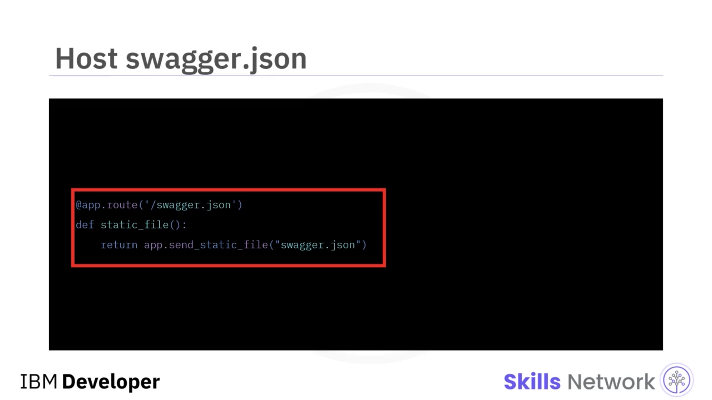
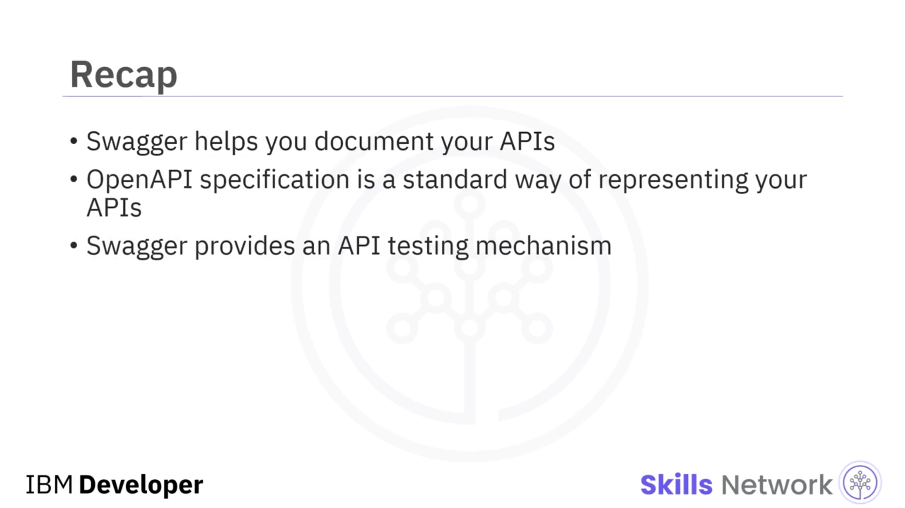

# 📘 Swagger ile REST API'leri Belgelemek ve Test Etmek

## 👋 Giriş

‘Documenting and Testing REST APIs with Swagger’a hoş geldiniz.

Bu videoyu izledikten sonra, REST API’nizi Swagger kullanarak belgeleyebilecek ve REST API’nizi Swagger kullanarak test edebileceksiniz.


API’ler bir arayüz tanımlar ve farklı sistemleri birbirine bağlayarak onlara tutarlı bir iletişim imkânı sağlar. API dokümantasyonu ise sistemleri etkin biçimde kullanma ve entegre etme talimatlarını içeren bir başvuru kılavuzu gibidir.

Swagger, OpenAPI specification'dan yararlanarak yönergelere uyduğunuzdan emin olur ve API dokümantasyonu yazarken zamandan tasarruf etmenizi sağlar. Swagger, API’lerinizin yapısını makinelerin okuyabileceği şekilde tanımlamanıza olanak tanır.

API’nin bu yapısını kullanarak Swagger, etkileyici bir kullanıcı arayüzü (UI) ve etkileşimli API dokümantasyonunu otomatik olarak oluşturur.


---

## 📚 OpenAPI Specification ve Standart API Tanımı

Bu yapı, OpenAPI specification’a uyan bir JSON veya YAML dosyasında tanımlanır.

Başlangıçta API’ler, self-servis tüketim için tasarlanmamıştı. Veri odaklıydılar ve bağlantı ile iletişimin birkaç özel kullanım senaryosunu çözüyorlardı.

Buna karşın OpenAPI Specification, RESTful API’ler için standart, dilden bağımsız bir arayüz tanımlar. Spesifikasyon dilden bağımsızdır ve hem insanlar hem makineler tarafından okunabilir.

Ayrıca, kaynak koda, ek dokümantasyona veya ağ trafiğinin incelenmesine gerek kalmadan, bir servisin yeteneklerinin insanlar ve bilgisayarlar tarafından keşfedilmesine ve anlaşılmasına olanak tanır.

API’nizin desteklediği tüm işlemleri, gerekli parametreleri, beklenen dönüş değerini ve gereken API kimlik doğrulamasını tanımlar. Hatta, sunulan API için kullanım koşulları, iletişim bilgileri ve lisans bilgileri gibi unsurları dahi tanımlar.


---

## 🐍 Flask ile Swagger UI Entegrasyonu

Flask, Python fonksiyonlarını API olarak dışa açmayı mümkün kılar.

Flask Swagger UI, REST API’leri tanımlamanıza ve görselleştirmenize imkân tanıyarak bu kabiliyetleri geliştirir. Uygulamanıza Swagger UI eklemek için `Flask-swagger-ui` adlı Flask  *blueprint* ’ine ihtiyaç duyarsınız.

Aşağıdaki komut, `pip` kullanarak Swagger UI’yi Flask uygulamanıza ekler:

```bash
pip install Flask-swagger-ui
```


İlk olarak, Swagger UI’yi Flask kullanarak oluşturmanıza yardımcı olacak `swagger_ui_blueprint` bileşenini içe aktarmanız gerekir.

Daha sonra, Swagger arayüzünün hangi yoldan erişilebilir olacağını belirten temel yapılandırmayı tanımlarsınız. Bu örnekte, bunu `products/docs` yolunun altında tuttunuz.

İkinci argüman, Swagger dosyasının nereden servis edildiğini ve bu Swagger arayüzüne vermek istediğiniz ismi belirtir.

Ardından, bu  *blueprint* ’i Flask uygulamasıyla kaydetmeniz gerekir.

`Swagger.JSON`, API’nizin tanımını ve özelliklerini JSON dosyası biçiminde barındırır. Bu dosyayı da API’nizle birlikte dışa açmanız gerekir. Bu nedenle, statik `swagger.JSON` dosyanızı servis edecek bir *route* tanımlamanız gerekir.


---

## 🧩 Swagger JSON Tanımı ve Ürün Mikroservisi Örneği

Swagger bir JSON dosyasıdır ve bazı temel yapılandırmaların mevcut olmasını gerektirir.

Bu örnekte, ürün mikroservisi için API Swagger tanımını oluşturuyor, ürün listesini almak için model ve yolu ( *path* ) tanımlıyorsunuz. Ayrıca `Product` nesnesinin özelliklerini tanımlıyorsunuz.

Artık bir API tanımınız ve Swagger yapılandırmanız var.



---

## 🧪 Swagger UI ile API Testi ve Sağladığı Avantajlar

Swagger kullanmanın temel faydası olarak, bu UI’yi API’nizi test etmek için kullanabilirsiniz.

Buna ek olarak, tüketicilerin API’niz, desteklenen fonksiyonlar, istekler ve yanıtlar hakkında daha fazla ayrıntı görmesine olanak tanır. Ayrıca ürün bilgi ( *product info* ) bölümündeki içeriği görüntüler.

Burada mevcut tek yöntemi, tüm ürünleri almak için kullanılan bir `GET` isteğini gösterir. Daha sonra bu  *endpoint* ’i çalıştırabilir ve sonucunu görebilirsiniz; bu örnekte sonuç, ürünlerin listesidir.


Bu videoda, Swagger’ın API’lerinizi belgelemeye yardımcı olduğunu, OpenAPI Specification’ın API’lerinizi temsil etmenin standart bir yolu olduğunu ve Swagger’ın API’lerinizi test etmek için bir mekanizma sağladığını öğrendiniz.


