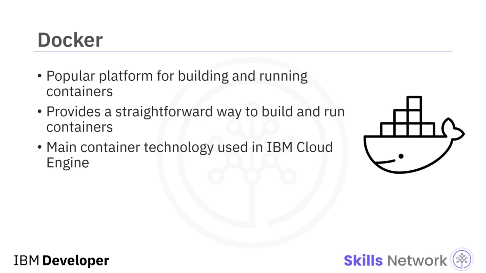

# 🧱 Mikroservisler için Konteyner İmajları Oluşturma

## 🎥 Dersin Amacı

“Mikroservisler için Konteyner İmajları Oluşturma”ya hoş geldiniz. Bu videoyu izledikten sonra bir konteynerin ne olduğunu açıklayabilecek, Docker'ın ne olduğunu açıklayabilecek ve bir Docker konteyner imajı oluşturabileceksiniz.

Bir konteyner, bağımsız, her şeyi içeren ve yürütülebilir bir yazılım birimidir. Uygulamanın kaynak kodu, kütüphaneleri, bağımlılıkları ve çalışma zamanları, konteyner içinde paketlenir.

Bir kez oluşturulduktan sonra konteyner, dizüstü bilgisayar, masaüstü PC veya şirket içi sunucular gibi herhangi bir cihazda çalışabilir. Ayrıca bulutta da çalışabilir.

Konteynerler, sanal makinenin aksine her örnekte bir misafir işletim sistemi gerektirmedikleri ve bunun yerine ana işletim sisteminin özelliklerinden ve kaynaklarından yararlanabildikleri için küçük, hızlı ve taşınabilirdir.

---

## 🐳 Mikroservisler ve Docker ile Konteynerleştirme

Bir mikroservisin temel unsurlarından biri, her çalışan örnek için genellikle hesaplama kaynakları açısından küçük ve yalıtılmış olmasıdır. Bu da konteyneri, mikroservis mimarileri içindeki bu tür küçük ve hafif hizmetler için mükemmel bir eşleşme hâline getirir.

Docker, uygulamaları konteyner olarak oluşturmaya ve çalıştırmaya yönelik bir yazılım platformudur. Docker, konteynerleştirmenin patlayıcı biçimde yaygınlaşmasına yol açmıştır.

Buna ek olarak, tamamlayıcı araçlar, teknolojiler ve geliştirme metodolojilerinden oluşan büyük bir koleksiyon hâlâ büyümekte ve büyük bir Docker ve konteynerleştirme ekonomisi oluşturmaktadır.

Docker, açık kaynaklı bir platform üzerinden konteynerleri oluşturmanın ve çalıştırmanın doğrudan ve yalın bir yolunu sunar. Docker, IBM Cloud Engine'de kullanılan temel konteyner teknolojisidir.

Bir konteyner imajı, bir cloud engine uygulamasının temelini oluşturur.

---

## 🧬 Dockerfile ile Kaynak Koddan Konteyner Oluşturma

Şimdi, bir konteyneri kaynak koddan bir `Dockerfile` kullanarak oluşturmanın tipik bir yolunu tartışalım.

Diyelim ki uygulama geliştirmesini tamamladınız ve kaynak kodu, bağımlılıkları ve kütüphaneleriyle birlikte bir IDE içinde yerel olarak test ettiniz. Ve şimdi bir Docker konteyneri oluşturmak istiyorsunuz.

İlk adım, bir `Dockerfile` oluşturmaktır. Bir `Dockerfile`, bir imajın oluşturulduğu bir tür *blueprint* gibi davranır. İstenen konteyneri oluşturmak için tüm talimatları tanımlar.

`Dockerfile` oluşturulduktan sonra bir konteyner imajı oluşturulur.

---

### 🧾 Konteyner İmajı ve Konteyner Arasındaki Fark

Bir konteyner imajı ile bir konteynerin iki farklı şey olduğunu unutmayın.

Bir imaj, bir uygulamanın çalışması için gereken kaynak kodu, kütüphaneler ve bağımlılıklar gibi tüm uygulama varlıklarını içeren değiştirilemez bir dosyadır. Ve imajlar salt okunurdur; bir imajı değiştirirseniz yeni bir imaj oluşturmuş olursunuz.

Nesne yönelimli programlamada olduğu gibi, bir konteyner imajını, çalışan bir konteynerin şablonu gibi davranan bir sınıf olarak düşünebilirsiniz. Dolayısıyla bir konteyner imajını örneklediğimizde, konteyner adı verilen çalışan bir imaj elde ederiz.

Yani temelde tek yapmanız gereken uygun bir `Dockerfile` yazmaktır; gerisini Docker halleder.

Şimdi, Flask tabanlı bir mikroservis oluşturmak için bir `Dockerfile` örneğine bakalım.

---

## 🧪 Flask Tabanlı Mikroservis için Dockerfile Örneği

Bir `Dockerfile`ın ilk satırı, kendisinden sonra gelen talimatların üzerine inşa edileceği temel imajı (base image) belirtmek için `FROM` talimatıyla başlar.

Bu temel imaj genellikle bir işletim sistemi gibi herkese açık bir depodan (public repository) ya da burada olduğu gibi Python gibi belirli bir dile ait bir temel imajdan gelir.

İsteğe bağlı olarak, genel Python Docker imajı yerine mikroservisinize daha iyi hizmet edecek, daha özel ve gelişmiş bir temel imaj ekleyebilirsiniz. Örneğin `uwsgi-nginx-flask`, Python'da uWSGI ve Nginx ile tek bir konteyner içinde çalışan bir Flask mikroservisi oluşturmanıza olanak tanır.

Sonraki `Copy` talimatı, tüm dosyaları imaj içindeki `/app` klasörüne kopyalar.

Ortam değişkenini (environment variable) ayarlamak için `ENV` talimatını kullanabilirsiniz. Burada, bu imajdan oluşturulan konteynerin 8080 portunu dinleyeceği anlamına gelecek şekilde `LISTEN PORT` değerini 8080 olarak ayarlarsınız.

---

### ⚙️ Dockerfile Talimatları: EXPOSE, RUN ve CMD

Bir `Dockerfile` içindeki `expose` anahtar sözcüğü, bir konteynerin 8080 üzerinde trafiği dinlediğini Docker'a belirtir.

Ve `RUN` talimatı komutları yürütür. Örneğin burada, gerekli tüm Python kütüphanelerini yüklemek için `pip install` komutunu çalıştırırız.

Ve sonuncusu `CMD`'dir. Bu talimatın temel amacı, bir konteyneri çalıştırmak için varsayılanı sağlamaktır. Bu talimat genellikle konteynerinizde çalışması gereken yürütülebilir dosyayı tanımlar.

Örnekte, Flask mikroservisini çalıştırırsınız.

Ancak, bir `Dockerfile` içinde yalnızca bir tane `CMD` talimatı olabileceğini unutmayın.

---

## 🗃️ Container Registry ve İmaj İsimlendirme

Konteyner imajınız oluşturulduktan sonra, daha iyi yönetilebilmesi için onu bir konteyner deposuna (container repository) gönderebilirsiniz. Bu konteyner deposuna konteyner kayıt defteri (`container registry`) adı verilir.

Bazı yaygın kayıt defterleri Docker Hub ve IBM Cloud Container Registry'dir.

Kayıt defterindeki konteyner imajı, benzersiz bir imaj adıyla kolayca alınabilir ve kullanılabilir.

Bir imaj adı, bir ana makine adı (hostname), bir depo (repository) ve bir etiketten (tag) oluşur. Ana makine adı, imajın hangi kayıt defterine gönderilmesi gerektiğini belirtir.

Örneğin `icr.io`, IBM Container Registry'yi temsil eder.

Şimdi bir depo (repository), birbiriyle ilişkili konteyner imajlarının bir grubudur. Ve genellikle bunlar, aynı uygulamanın veya hizmetin farklı sürümleri olacağından, uygulamanın veya hizmetin adı iyi bir depo adı olur.

Son olarak, etiket (tag), bir imajın belirli sürümü veya varyantı hakkında bilgi sağlar.

---

### 📌 Özet

Bu videoda şunları öğrendiniz:

* Bir konteyner, tüm bağımlılıklarıyla paketlenmiş, bağımsız yürütülebilir bir yazılım birimidir.
* Docker, konteyner oluşturmak ve çalıştırmak için kullanılan çok popüler bir platformdur.
* Docker platformuna bir konteyner imajı oluşturmasını söylemek için bir `Dockerfile` yazabilirsiniz.
* Ve konteyner imajı oluşturulduktan sonra, konteyner kayıt defterine gönderilebilir ve daha sonra imaj adıyla alınabilir.

