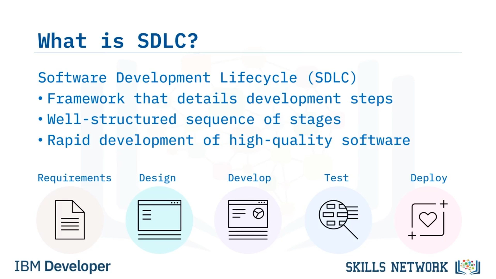

# 🔐 Security by Design

## 🎯 Öğrenme Hedefleri

Security by Design’e hoş geldiniz!

Bu videoyu izledikten sonra şunları yapabileceksiniz: Security by Design’i tanımlamak, güvenli yazılım geliştirme yaşam döngüsünü (*secure Software Development Lifecycle* veya  *SDLC* ) tanımlamak ve  *DevOps* ’u güvenli bir *SDLC* ile nasıl eşleştireceğinizi açıklamak.

---

## ⚠️ Güvenlik Neden Son Anda Düşünülmemeli?

Projeler oluştururken muhtemelen her şeyi güvenliği hiç dikkate almadan yaptınız. Güvenlik, sonradan akla gelen bir düşünceydi. Eninde sonunda güvenlik ekibi tüm sunucuları kapatır ve kod kırılırdı.

Bu, güvenliğin neden son dakika kararı olmaması gerektiğinin başlıca nedenlerinden biridir. Bunu aşmak için, her zaman bir güvenlik ekibini işe dâhil edin. Güvenlik uzmanlarıyla en baştan ve düzenli olarak sağlam bir iş birliği kurun; çünkü kodunuzu güvenli bir şekilde yazmanız kritik önem taşır.

*DevOps* ile güvenli bir uygulama geliştirebilirsiniz.

---

## 🧭 Yazılım Geliştirme Yaşam Döngüsü (SDLC)

*Software Development Lifecycle* ( *SDLC* ), yazılım geliştirme sürecinde her aşamada yer alan adımları belirleyen bir çerçevedir. Bir programın geliştirilmesi, dağıtılması ve bakımına yönelik stratejiyi ayrıntılı biçimde açıklar.

 *SDLC* , tamamen test edilmiş, üretime hazır, yüksek kaliteli yazılımın hızlı bir şekilde geliştirilmesine yol açan iyi yapılandırılmış bir aşama dizisidir.

---

## 🧱 SDLC Aşamaları

 *SDLC* ’nin farklı aşamaları şunlardır:

* **Requirements (Gereksinimler)** : Proje ekibinin, müşteri beklentilerini proje için anlamaya başladığı aşama.
* **Design (Tasarım)** : Gereksinimler aşamasında oluşturduğunuz gereksinim listesine dayalı kararların alındığı aşama.
* **Develop (Geliştirme)** : Tasarımın hayata geçirildiği aşama.
* **Test (Test)** : Geliştiricilerin kodlarını ve programlamayı, müşteri ihtiyaçlarını karşılayıp karşılamadığını veya işlevselliğin sorunsuz olup olmadığını görmek için test ettikleri aşama.
* **Deploy (Dağıtım)** : Ürün, proje ekibi tarafından test edildikten ve her test aşamasını geçtikten sonra canlıya almaya hazır olduğunda yürütülen aşama.

---

## 🛡️ Güvenli SDLC (Secure SDLC)

 *Secure SDLC* , güvenliğin yazılım geliştirme yaşam döngüsünün farklı aşamalarına nasıl uyduğunu açıklar.

Mevcut geliştirme modeline güvenlik testini ve en iyi uygulamalarını dâhil etme süreci şunları içerir:

* Risk değerlendirmesi,
* Tehdit modelleme ve tasarım incelemesi,
* Statik analiz,
* Güvenlik testi ve kod incelemesi,
* Güvenlik değerlendirmesi ve güvenlik yapılandırması.

---

## 🔄 DevOps’u Güvenli SDLC Aşamalarına Haritalamak

### 📌 Gereksinimler Aşaması: Risk ve Saldırı Profili

 *DevOps* ’u güvenli bir  *SDLC* ’nin aşamalarına nasıl haritalayabilirsiniz?

Gereksinimler aşamasında, risk değerlendirmesi yapar ve insanların koda nasıl saldırabileceğini hesaba katarsınız. Güvenlik ihtiyaçlarını ve standartlarını, ayrıca hangi tür bilgilerle uğraştığınızı belirlediğinizden emin olun.

Korunacak bilgileri tanımladığınız güvenlik gereksinimlerini belirleyin. Ve tasarım tehdit modelleme süreci boyunca neler olup bitebileceğini anlamak için saldırı profilini çıkarın.

---

### 🧩 Tasarım Aşaması: Güvenli Mimari Tasarımı

Tasarım aşaması, güvenli bir şekilde tasarlamakla ilgilidir. Tasarım tehdit modellemesi sırasında şu soruları sorun: Mimarinizi savunmasız hâle getirebilecek bazı unsurlar nelerdir?

Bu aşamada alınabilecek önlemler için nasıl güvenli bir şekilde tasarım yapabilirsiniz?

Dağıtım hattını ( *deployment pipeline* ) güvence altına almak, güvenli bir tasarıma sahip olduğunuzdan, tüm testleri doğru şekilde otomatikleştirdiğinizden ve sürekli entegrasyon/sürekli teslim (*continuous integration/continuous delivery* veya  *CI/CD* ) hattınızın güvenlik açıklarını aradığından emin olmakla ilgilidir.

*DevOps* ile, güvenlik ekibi üyeleri, yaygın tehdit türleri konusunda *Dev* ekibi üyelerini bilgilendirebilir ve bu tehditlere karşı birim testleri oluşturmalarına yardımcı olabilir.

---

### 💻 Geliştirme Aşaması: Statik Analiz ve Güvenli Scrum

Geliştirme aşamasında, kodunuzdaki güvenlik açıklarını kontrol edecek, koda bakacak ve onu güvensiz olarak nitelendirecek araçlarla statik analiz gerçekleştirebilirsiniz.

Bu aşama, sistemdeki bilgilerin hem doğru hem de faydalı olmasını garanti etmek için otomatikleştirilmiş verilerin doğrulanmasını içerir.

Güvenlik görevleri ve güvenli  *scrum* , *SDLC* boyunca güvenli yazılım geliştirmeye vurgu yapan bir *scrum* çerçevesi varyasyonudur.

---

### 🧪 Test Aşaması: Güvenlik Testleri ve Paralel Çalıştırma

Test aşamasında, zafiyet taramalarını dâhil etmek istersiniz. Kodunuz üzerinde güvenlik testleri yaparsınız ve yayına almadan önce bir risk değerlendirmesi gerçekleştirirsiniz.

Başarısızlık için çabalayın: Uygulamanızı siz kırabiliyorsanız, saldırganların da bunu yapabilme olasılığı yüksektir.

Güvenlik testlerini paralelleştirin: Zaman kazanmak için, test penceresini kısaltmak amacıyla kod tarayıcılarını birim testleri ve işlevsel doğrulama testleri (*functional verification tests* veya  *FVTs* ) ile birlikte paralel olarak çalıştırın.

---

### 🚀 Dağıtım Aşaması: Rollback ve Üretim Güvenlik Testleri

Dağıtım aşamasına geldiğinizde ve kodunuz üretimdeyken, çeşitli yollarla güvenli bir şekilde çalıştığından emin olursunuz.

Otomatik olarak çalışan dağıtım betiklerini kullanabilirsiniz. Ayrıca *deploy and roll back* yaklaşımını da kullanabilirsiniz; bu, bir dosya yükleme dağıtımı için, geri alma ( *rollback* ) işleminin esasen yapılan değişiklikleri geri alacağı anlamına gelir.

Dolayısıyla, bir dosya daha önce yüklenmişse, silinecektir; bir değişiklik yapılmışsa geri alınacaktır; bir dosya kaldırılmışsa geri yerine konacaktır.

Ve üretim güvenlik testleri gerçekleştirebilirsiniz; bunlar, cihazınızda veya uygulamanızda gizli kusurları ortaya çıkarmak için gerçek dünyadaki saldırı yöntemlerini ve yaklaşımlarını taklit eder. Bu testler size gerçekçi içgörüler ve pratik sonuçlar sağlayabilir.

---

## ✅ Özet

Bu videoda şunları öğrendiniz:

Güvenlik ekibiyle iş birliği yaparak yeni özelliklerin sorunsuz bir şekilde hayata geçirilmesini daha iyi anlayabilir ve deneyimleyebilirsiniz.

Güvenli  *SDLC* , mevcut geliştirme modeline güvenlik testini ve en iyi uygulamalarını dâhil eden bir süreçtir.

*SDLC* aşamaları gereksinimler, tasarım, geliştirme, test ve dağıtımdır.

Ve güvenli  *SDLC* ’yi, risk değerlendirmeleri yaparak ve bireylerin kodunuza nasıl saldırabileceğini inceleyerek bu aşamalarla eşleştirebilirsiniz.

