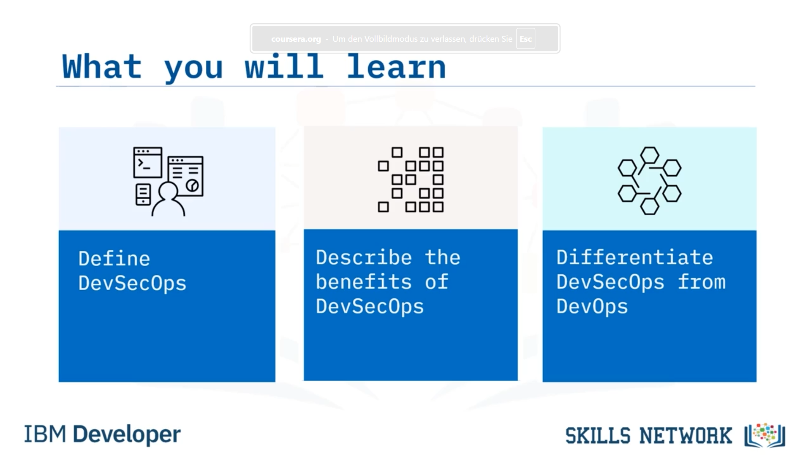
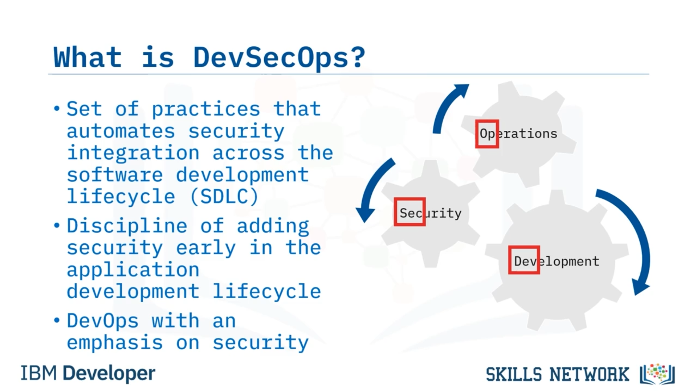
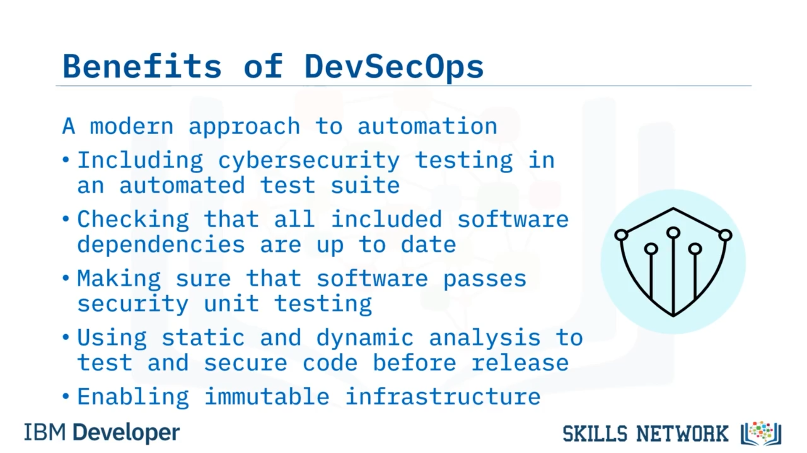

# 🔐 DevSecOps Nedir?

## 🎬 “What is DevSecOps?” Videosuna Hoş Geldiniz

*What is DevSecOps?* bölümüne hoş geldiniz. Bu videoyu izledikten sonra şunları yapabileceksiniz:  *DevSecOps* ’u tanımlamak;  *DevSecOps* ’un faydalarını açıklamak; ve *DevSecOps* ile *DevOps* arasındaki farkı ayırt etmek.

 *DevSecOps* , yazılım geliştirme yaşam döngüsü ( *SDLC* ) boyunca, ilk tasarımdan entegrasyon, test, dağıtım ve yazılım teslimine kadar güvenlik entegrasyonunu otomatikleştiren bir uygulama setidir.

Bu, riskleri azaltmak ve güvenliği bilgi teknolojileri ( *IT* ) ve işletmenin hedefleriyle daha sıkı entegre etmek için, uygulama geliştirme yaşam döngüsünün erken safhalarında güvenlik ekleme disiplinidir.

 *DevSecOps* , temelde güvenliğe vurgu yapan bir *DevOps* yaklaşımıdır. Adını geliştirme ( *development* ), güvenlik ( *security* ) ve operasyonlardan ( *operations* ) alır. Geliştirme, yeni yazılım sürümleri ve yazılım güncellemeleri anlamına gelir.

Güvenlik, erişilebilirlik, bütünlük ve gizliliği ifade eder. Operasyon ise güvenilirliğe dayalı performans ölçeklemesidir.

## ⭐ DevSecOps’in Avantajları

 *DevSecOps* ’in avantajları nelerdir? İşte en önemli beş faydası:

1. Yüksek kaliteli yazılımı hızlı ve uygun maliyetle teslim etmek.
2. Proaktif önlemler yoluyla artırılmış güvenlik.
3. Güvenlik açıklarının hızlandırılmış bir tempoda yamalanması.
4. Otomasyona modern bir yaklaşım.
5. Tekrarlama döngüsü ve uyum sağlama yeteneği.

---

## 🚀 1. Yüksek Kaliteli Yazılımı Hızlı ve Uygun Maliyetle Teslim Etmek

Şimdi ayrıntılara bakalım: İlk olarak, yüksek kaliteli yazılımı hızlı ve uygun maliyetle teslim etmek ne anlama gelir?

Yazılım *DevSecOps* olmayan bir ortamda geliştirildiğinde, güvenlik sorunları ciddi zaman gecikmelerine neden olabilir. Kodlama ve güvenlik açıklarını gidermek zaman alıcı ve maliyetli olabilir.

 *DevSecOps* , geliştirme maliyetlerini en aza indirmek için bir işlemi tekrar etme gereksinimini azaltarak, güvenlik açıklarını düzeltmek için harcanan zamanı azaltmaya yardımcı olur.

Entegre güvenlik, gereksiz incelemeleri ve yeniden derlemeleri ortadan kaldırdıkça, çalışma daha verimli ve maliyet açısından daha etkili hâle gelir ve daha iyi ve daha güvenli kodla sonuçlanır.

Giderleri azaltırken teslimat hızlarınız artar.

---

## 🛡️ 2. Proaktif Önlemlerle Artırılmış Güvenlik

Sonra, proaktif önlemlerle artırılmış güvenlik nedir?

 *DevSecOps* , güvenliği, izlemeyi, dağıtımı ve bildirim sistemlerini kontrol ederek, siber güvenlik uygulamalarını daha başından geliştirme yaşam döngüsüne entegre eder. Endişe verici bir husus tespit edilir edilmez giderilir.

Güvenlik açıkları yaşam döngüsünün erken safhalarında tanımlanıp ele alındığında, bunları çözmenin maliyeti daha düşük olur. Ek bağımlılıklar yalnızca güvenlik sorunları çözüldükten sonra devreye alınır.

*DevSecOps* yaklaşımları, güvenlik açıklarını yamamak için gereken süreyi kısaltarak, güvenlik ekiplerinin daha yüksek değerli görevlere odaklanmasına imkân tanır.

Bu teknikler, uyumluluğu sağlamaya ve kolaylaştırmaya yardımcı olur ve uygulama geliştirme projelerinin güvenlik nedeniyle değiştirilmesi ihtiyacını ortadan kaldırır.

---

## ⚡ 3. Hızlandırılmış Güvenlik Açığı Yamaları

Sonra, hızlandırılmış bir tempoda güvenlik açığı yamalamak ne anlama gelir?

 *DevSecOps* ’un başlıca faydalarından biri, yeni keşfedilen güvenlik kusurlarını yönetme hızıdır.

Güvenlik açığı taraması ve yamalamayı sürüm döngüsüne dâhil etmek, bir tehdit aktörünün, kamuya açık üretim sistemlerindeki zafiyetleri sömürme olasılığını azaltır.

 *DevSecOps* , geliştirmenin en başından itibaren erişilebilirliği ve şeffaflığı güçlendirir.

---

## 🤖 4. Otomasyona Modern Bir Yaklaşım

Sonraki soru, otomasyona modern bir yaklaşım nedir?

Kuruluşunuz yazılımını dağıtmak için sürekli entegrasyon/sürekli teslim ( *CI/CD* ) hattı kullanıyorsa, operasyon ekipleri için otomatik bir test paketine siber güvenlik testlerini dâhil etmelisiniz.

Güvenlik süreçlerinin otomasyonu, büyük ölçüde proje ve organizasyon hedeflerinden etkilenir. Otomatik testler, dâhil edilen tüm yazılım bağımlılıklarının güncel olduğunu kontrol eder ve yazılımın güvenlik birim testlerinden geçtiğini garanti eder.

Statik ve dinamik analizler, kodu üretime almadan önce test eder ve güvence altına alır.

Ayrıca,  *Immutable infrastructure* ’ın etkinleştirilmesi, tam güvenliği artırmak için güvenlik otomasyonunu içerir.

---

## 🔁 5. Tekrarlama Döngüsü ve Uyum Sağlama Yeteneği

Ve beşinci fayda olarak, tekrarlama döngüsü ve uyum sağlama yeteneği nedir?

Kuruluşlar geliştikçe, güvenlik duruşları da gelişir.  *DevSecOps* , ortam geliştikçe ve yeni gereksinimlere uyum sağladıkça, güvenliğin ortam genelinde tutarlı şekilde uygulanmasını garanti eden tekrarlanabilir ve uyarlanabilir süreçler sağlar.

Olgun bir *DevSecOps* sistemi, güçlü otomasyon, yapılandırma yönetimi, orkestrasyon, konteynerler, *immutable infrastructure* ve hatta güvenlik olayından sonra daha hızlı kurtarma sağlayan sunucusuz hesaplama ortamları içerir.

Burada her şey *DevSecOps* ile ilgilidir: güvenlik kontrollerinin geliştirme, dağıtım ve operasyon süreçleri boyunca doğal şekilde entegrasyonu.

---

## 📚 Bu Videoda Öğrendikleriniz

Bu videoda şunları öğrendiniz:

Fikirden uygulamaya, testten dağıtım ve teslimata kadar, *DevSecOps* güvenlik entegrasyonunu *SDLC* boyunca otomatikleştirir.

*DevSecOps* pek çok fayda sağlar:

* Zamanında ve maliyet etkin biçimde daha yüksek kaliteli yazılım.
* Önleyici eylemler sonucunda geliştirilmiş güvenlik.
* Güvenlik açıklarının son derece hızlı biçimde giderilmesi.
* Otomasyona modern bir bakış açısı.
* Ve tekrarlama döngüsü ile uyum sağlama yeteneği.

