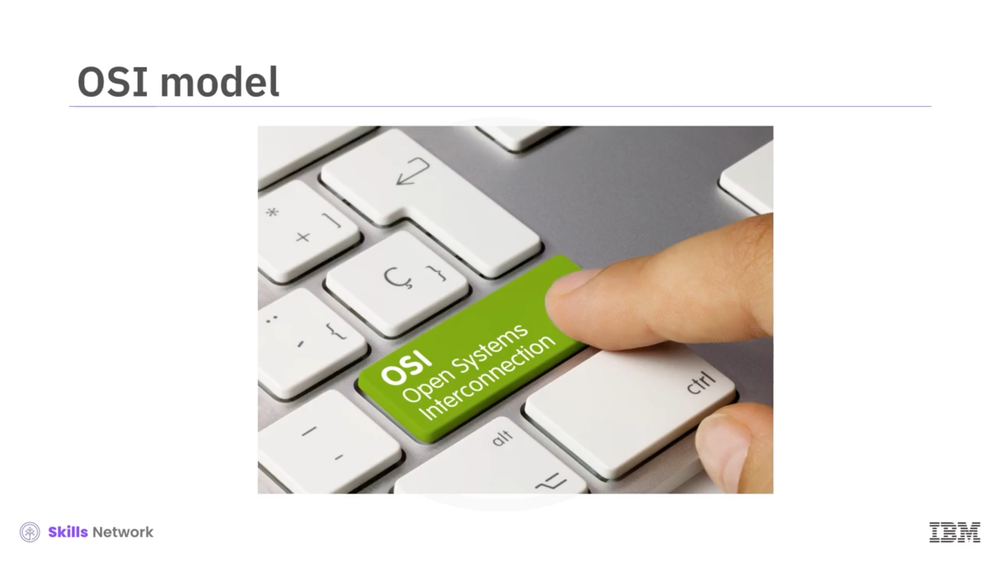
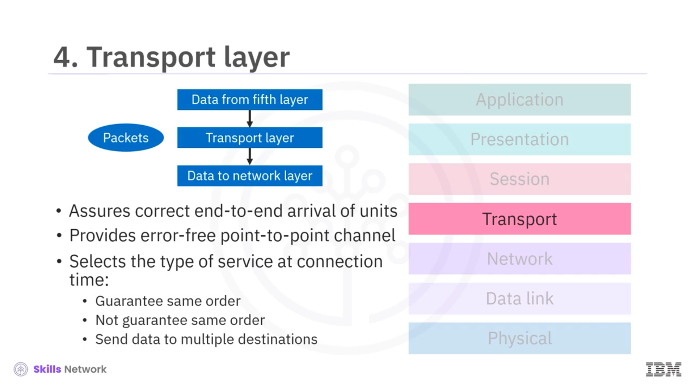
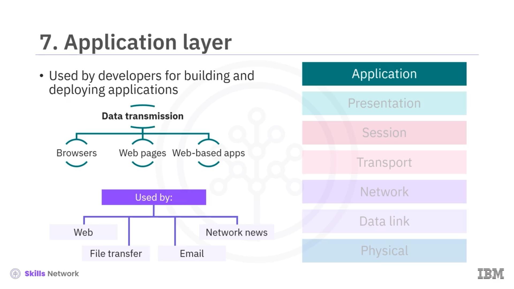

# 🌐 OSI Modeli

## 🎯 Öğrenme Hedefleri

OSI Modeli’ne hoş geldiniz.

Bu videoyu izledikten sonra *Open Systems Interconnection* ya da **OSI modeli**ni açıklayabilecek, OSI modelinin yedi katmanını sıralayıp tanımlayabilecek ve geliştiriciler için gerekli OSI katmanlarını belirleyebileceksiniz.

## 🌍 İnternet ve OSI Modelinin Ortaya Çıkışı

İnternet, birbirine bağlı kablolar aracılığıyla tüm dünyaya yayılan karmaşık bir ağlar ağıdır.

E-postalar, telefon görüşmeleri, yayın (streaming) etkinlikleri vb. her türlü veri İnternet üzerinden geçer.

İnternetin öncülerinin, günümüzdeki ve gelecekteki iletişim türlerinin dünya genelinde herkes tarafından kullanılabilmesini sağlayacak bir sistem oluşturmaları gerekiyordu.

Bunu çözmek için *Open Systems Interconnection* ya da kısaca **OSI modeli** olarak adlandırılan yapıyı tasarladılar.

## 🧱 OSI Modelinin 7 Katmanı

OSI modeli, veri göndermek ve almak için kullanılan yedi katmandan oluşur.

Bu katmanlar; Fiziksel katman ( *Physical layer* ), Veri Bağlantı katmanı ( *Data Link layer* ), Ağ katmanı ( *Network layer* ), Taşıma katmanı ( *Transport layer* ), Oturum katmanı ( *Session layer* ), Sunum katmanı ( *Presentation layer* ) ve son olarak Uygulama katmanıdır ( *Application layer* ).

---

### 1️⃣ Fiziksel Katman ( *Physical Layer* )

En alt katman, yani 1. katman, Fiziksel katmandır.

Fiziksel katmanın amacı, ham bilgi bitlerini iletmektir.

Veriler karşılıklı olarak aktarılırken fiziksel katmana yönelik tutarlı bir iletişim kanalı bulunur.

Örneğin, bir iletişim kanalının bir ucundan veri gönderildiğinde, diğer ucunda bu verinin alınabilmesi gerekir.

---

### 2️⃣ Veri Bağlantı Katmanı ( *Data Link Layer* )

İkinci katman, yani 2. katman, Veri Bağlantı katmanıdır ( *Data Link layer* ).

Veri Bağlantı katmanı, iletilen ham veriyi, tespit edilmemiş hatalardan arındırılmış bir hat üzerinde taşınacak hâle dönüştürür.

Bu dönüşüm, veri çerçeveleri ( *data frames* ) kullanılarak gerçekleştirilir.

Veri çerçeveleri, 100 ya da 1000 baytlık gruplar hâlinde ardışık olarak iletilir.

Veri çerçeveleri alındıktan sonra, alıcı, verinin doğru şekilde ulaştığını onaylamak için geri bir onay çerçevesi ( *acknowledgment frame* ) gönderir.

---

### 3️⃣ Ağ Katmanı ( *Network Layer* )

Bir sonraki katman, OSI modelinin üçüncü katmanı olan Ağ katmanıdır ( *Network layer* ).

Bu katman, veri iletimini ve alt ağın ( *subnet* ) kontrolünü gerçekleştirir.

Ağ katmanı, bir kaynaktan bir hedefe kaç paketin yönlendirileceğini belirler.

Örneğin bir ağ yöneticisiyseniz ( *network administrator* ), verilere ağdan ve ağa giden yolların yönlendirilmesi için statik tablolardaki ağ rotalarını yönetebilirsiniz.

---

### 4️⃣ Taşıma Katmanı ( *Transport Layer* )

Daha sonra, OSI modelinin 4. katmanı olan Taşıma katmanı ( *Transport layer* ) gelir.

Taşıma katmanı, üst katmandan gelen iletimleri ya da verileri kabul eder ve bunları, Ağ katmanına iletilmek üzere daha küçük birimlere ya da paketlere böler.

Ayrıca Taşıma katmanı, tüm bu birimlerin uçtan uca doğru şekilde ulaşmasını garanti eder.

Bu katman, verileri gönderildikleri sırayla ileten, hatasız bir uçtan uca ( *point-to-point* ) kanal sağlar.

Bağlantı kurulurken, Taşıma katmanı kullanılacak hizmet türünü seçer.

Aynı sırayı garanti edebilir.

Ya da aynı sırayı garanti etmeyebilir.

Veya verileri birden fazla hedefe gönderebilir.

---

### 5️⃣ Oturum Katmanı ( *Session Layer* )

OSI modelinin 5. katmanı Oturum katmanıdır ( *Session layer* ).

Oturum katmanı, farklı makinelerden birden fazla oturum oluşturur ve bir çökme meydana geldiğinde tutarlı oturumların yeniden kurulmasını sağlar.

Bu katman, iki kullanıcının aynı önemli işlemi aynı anda gerçekleştirmeye çalışmasını önleyen iletişim (diyalog) kontrolü, iletim sırası takibi ve jeton yönetimi ( *token management* ) gibi avantajlar sunar.

Oturum katmanı ayrıca, uzun süreli iletimlerden sonra oturumların yeniden kurulabilmesi ve son kalınan noktadan devam edilebilmesi için eşzamanlama ( *synchronization* ) sağlar.

---

### 6️⃣ Sunum Katmanı ( *Presentation Layer* )

6. katman, bir noktadan diğerine iletilen verinin sözdizimine ve anlamına odaklanan Sunum katmanıdır ( *Presentation layer* ).

Veri akışı üzerinde, nihai hedefte özgün biçimi yeniden oluşturmak için serileştirme ve serileştirmeden çıkarma ( *serialization / deserialization* ) işlemleri gerçekleştirilir.

Örneğin `jpeg`, `gif` ve ASCII metin gibi biçimler veya dosya türleri Sunum katmanında yaygın ve sık biçimde kullanılır.

Buna ek olarak bu katman, veri sıkıştırma, şifreleme ve şifre çözme işlemlerini de sağlar.

---

### 7️⃣ Uygulama Katmanı ( *Application Layer* )

7. katman olan Uygulama katmanı ( *Application layer* ), OSI modelinin en üst katmanıdır.

Geliştiriciler ağırlıklı olarak bu katmanı uygulama geliştirmek ve dağıtmak için kullanırlar.

Tarayıcılar, web sayfaları ve diğer web tabanlı uygulamalar veriyi Uygulama katmanı üzerinde iletir.

Web’in yanı sıra, dosya aktarımı, elektronik posta ya da e-posta ve ağ haberleri ( *network news* ), 7. katmanı kullanan diğer uygulamalardır.

---

## 👨‍💻 Geliştiriciler İçin Odak Noktası Katmanlar

Bir geliştirici olarak, OSI modelinin üstteki üç katmanını bilmeniz ve onlara odaklanmanız gerekir:

5. katman Oturum katmanı, 6. katman Sunum katmanı ve 7. katman Uygulama katmanı.

Bir istemci bir sunucudan bir kaynak talep ettiğinde, istemci ile sunucu arasında OSI modelinin Oturum katmanında gerçekleşen bir bağlantı kurulur.

Kullanıcı tarafından gönderilen verileri olası *man in the middle* (ortadaki adam) saldırılarından korumak için Sunum katmanında güvenli soket şifrelemesini ( *secure socket encryption* ) kullanabilirsiniz.

Geliştiricilerin uygulamaları güvence altına almak için kullanabileceği bir diğer yöntem ise `443` numaralı portu ve `HTTPS` olarak bilinen güvenli `HTTP` sürümünü kullanmaktır.

Uygulama düzeyinde güvensiz iletişimi ortadan kaldırarak, bir yazılım geliştirici olarak uygulama kullanıcılarınızla gerekli güveni inşa edebilirsiniz.

---

## 🧾 Özet

OSI modeli, ağ iletişimi kavramlarını anlamak ve tartışmak için etkili bir araçtır ve birçok modern ağ standardı ve teknolojisinin temelini oluşturur.

Bu videoda, OSI modelinin, mevcut ve gelecekteki iletişim türlerinin dünya genelinde herkes tarafından kullanılabilmesine imkân tanıyan bir sistem olduğunu öğrendiniz.

OSI modeli, veri göndermek ve almak için kullanılan yedi katmandan oluşur.

Birinci katman Fiziksel katman, ardından Veri Bağlantı katmanı, Ağ katmanı, Taşıma katmanı, Oturum katmanı, Sunum katmanı ve son olarak Uygulama katmanıdır.

Geliştiriciler, OSI modelinin en üstteki üç katmanına, yani Oturum, Sunum ve Uygulama katmanlarına odaklanmalıdır.

