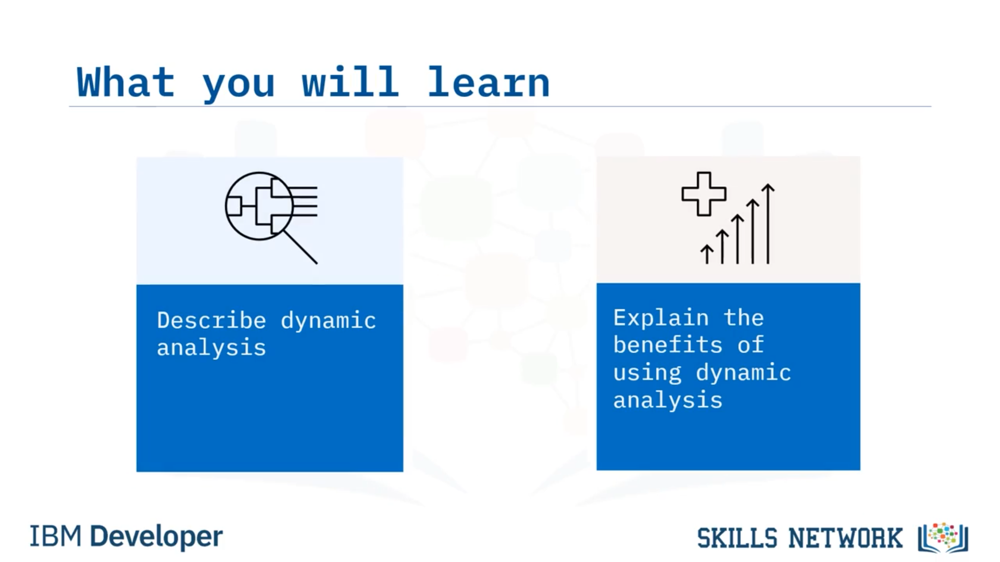
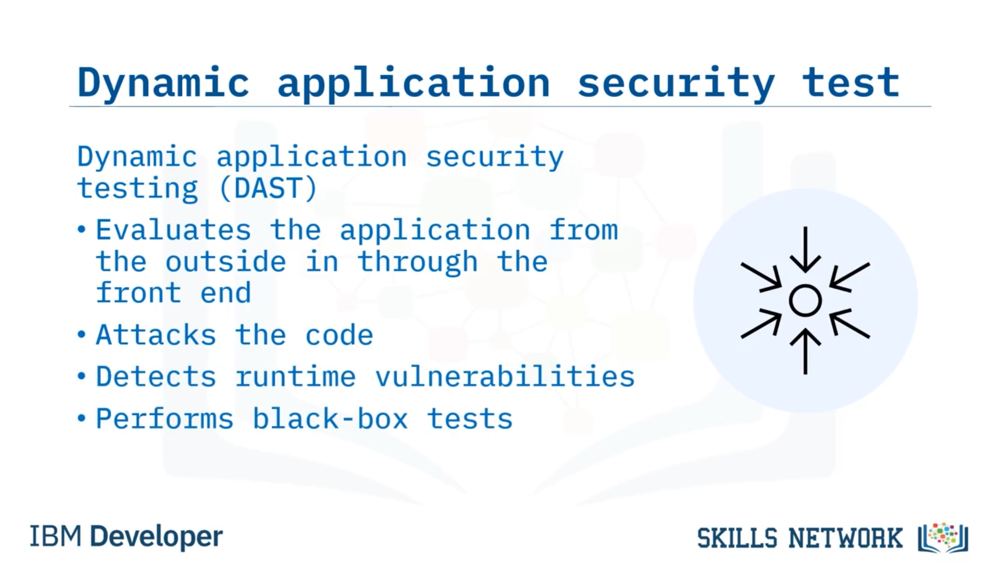
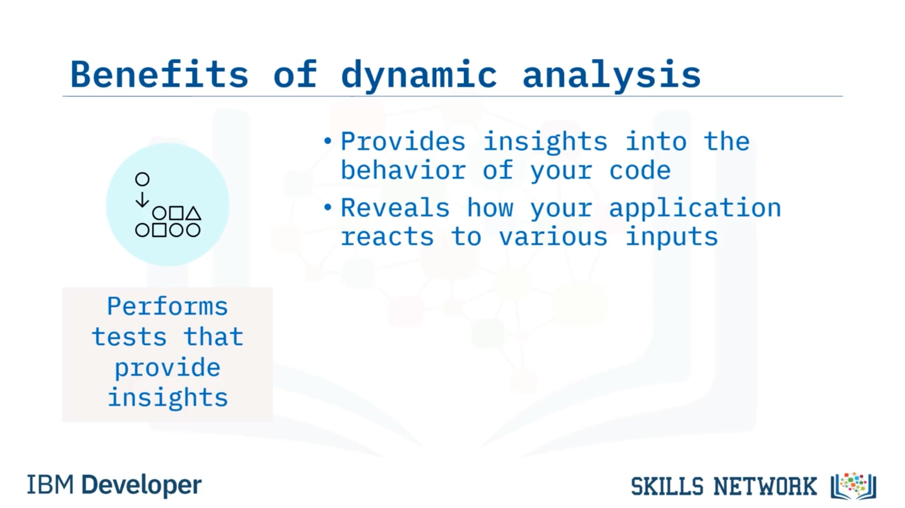
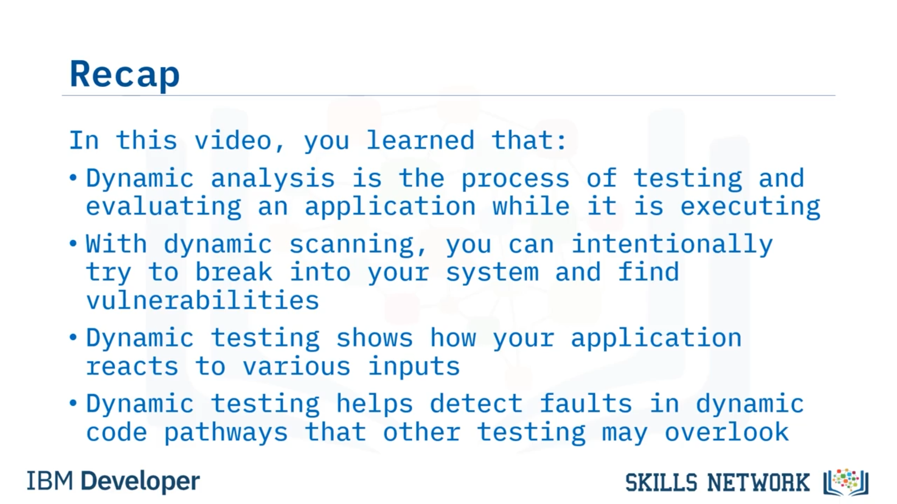

# 🔍 Dinamik Analiz

## 🎥 Dinamik Analize Hoş Geldiniz

Dinamik Analize hoş geldiniz!

Bu videoyu izledikten sonra şunları yapabileceksiniz:

*Dinamik analizi tanımlamak* ve  *dinamik analiz kullanmanın faydalarını açıklamak* .

## Peki dinamik analiz nedir?

 *Dinamik analiz* , bir uygulamayı çalışırken test etme ve değerlendirme sürecidir.

Dinamik analiz genellikle tamamen derlenmiş (tamamlanmış) uygulamalar üzerinde çalıştırılır.

Statik analizi çoğunlukla geliştirme aşamasında gerçekleştirirken, dinamik analizi  *staging* , *pre-prod* ortamlarında veya hatta kodu üretim ortamına dağıttıktan sonra uygularsınız.

Dinamik analiz, yapay olarak test vakaları veya senaryolar oluşturma ihtiyacını ortadan kaldırır ve doğrudan gerçek zamanlı durumlara geçer.

Bu, üretim ortamındaki güvenlik açıklarını, bellek sorunlarını ve olası çökme durumlarını belirlemeye yardımcı olur.

---

## 🛡️ DAST ve Dinamik Analizin Rolü

*Dinamik uygulama güvenliği testi* ( *Dynamic Application Security Testing – DAST* ), uygulamayı dışarıdan içeriye, *front end* (ön uç) üzerinden değerlendirir.

 *DAST* , fonksiyonel test değildir.

Bir saldırgan gibi davranır.

Olası tehditleri ve güvenlik açıklarını tespit etmek için saldırıları simüle eder.

 *DAST* , kaynak koda erişimi olmadığı için, girdilerin ve çıktılarının davranışlarını analiz eden *black-box testing* (kara kutu testi) gerçekleştirir.

---

## ✅ Dinamik Analiz Kullanmanın Üç Temel Faydası

Dinamik analiz kullanmanın üç temel faydası şunlardır:

* Dinamik analiz aracı, bir uygulamanın arayüzünü dinamik bir şekilde tarar ( *crawl eder* ).
* Kodun davranışına dair içgörü sağlayan testler gerçekleştirir.
* Dinamik kod yollarındaki hataları ortaya çıkarmaya yardımcı olur.

---

## 🌐 1. Uygulama Arayüzünün Tarandığı Dinamik Taramalar

İlk olarak, bir uygulamanın arayüzünü taramanın faydası nedir?

Dinamik tarama ( *dynamic scanning* ) kullanarak, dinamik analiz aracı kodu  *root URL* ’den itibaren inceler.

Dinamik tarama ile sisteminize kasıtlı olarak sızmayı deneyebilirsiniz.

Ve kodunuzdaki zayıf noktaları ( *breakpoints* ) ve güvenlik açıklarını tespit ederek, bunları yamalamak için avantaj elde edebilirsiniz.

Bu, faydalardan biridir.

---

## 🔍 2. Kod Davranışına İçgörü Sağlayan Testler

Sonraki fayda, dinamik analiz aracının, kodun davranışına dair içgörü sağlayan testler gerçekleştirmesidir.

Bu testler, uygulamanızın çeşitli girdilere nasıl tepki verdiğini gösterir.

Girdiler, bir URL’nin gerçekleştirdiği bir eylem ya da bir form üzerinden yapılan bir işlem şeklinde olabilir.

Burada, kullanmaya çalıştığınız verinin hiçbir şekilde gerçek zamanlı veritabanınıza zarar vermediğinden emin olmanız gerekir; bu nedenle, güvenlik için testlerinizi çalıştırırken *dummy* (sahte) bir veritabanı kullanın.

Bu testlerden elde edilen sonuçların analizi, kodun girdiler karşısında nasıl davrandığına dair size içgörü sağlar.

Bu sonuçlar, kodunuzun olması gerektiği gibi çalışıp çalışmadığını ya da çöktüğünü, hata fırlattığını veya olması gerekenden farklı şekilde çalıştığını size gösterecektir.

---

## 🧭 3. Dinamik Kod Yollarındaki Hataların Ortaya Çıkarılması

Ve bir dinamik analiz aracı kullanmak, dinamik kod yollarındaki hataları ortaya çıkarmaya yardımcı olur.

Dinamik analiz, diğer testlerin statik kod yollarında kaçırmış olabileceği hataları tespit etmeye ve raporlamaya yardımcı olur.

Dolayısıyla dinamik analiz, kodda nerede değişiklik yapmanız gerektiğine dair size net bir fikir verir.

Kod, çalışırken dinamik olarak test edildiği için, dinamik analiz size gerçek ve doğru sonuçlar sağlar.

Yapmanız gereken değişiklikleri bulmanıza ve anlamanıza yardımcı olur.

---

## 📚 Bu Videoda Öğrendikleriniz

Bu videoda şunları öğrendiniz:

* Dinamik analiz, bir uygulamayı çalışırken test etme ve değerlendirme sürecidir.
* Dinamik tarama ( *dynamic scanning* ) ile sisteminize kasıtlı olarak sızmayı deneyebilir ve güvenlik açıklarını bulabilirsiniz.
* Dinamik testler, uygulamanızın çeşitli girdilere nasıl tepki verdiğini gösterir.
* Ve dinamik testler, diğer testlerin gözden kaçırabileceği dinamik kod yollarındaki hataları tespit etmenize yardımcı olur.

